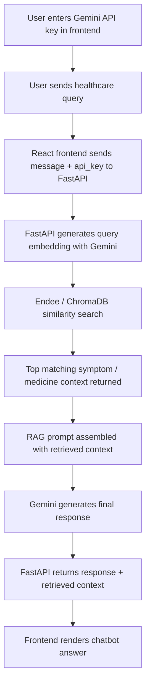

# RAG Healthcare Assistant Bot

A full-stack healthcare chatbot built with:

- `FastAPI` for the backend API
- `React + Vite` for the frontend
- `Gemini API` for embeddings and response generation
- `Endee (ChromaDB)` as the vector database

The app uses Retrieval-Augmented Generation (RAG) to search a local healthcare knowledge base before generating a response. Each user provides their own Gemini API key in the UI, and that key is used only in-memory per request.

## Features

- Healthcare chatbot with RAG-based context retrieval
- User-provided Gemini API key from the frontend
- No server-side API key storage
- Endee/ChromaDB-backed semantic search
- Context-aware responses using retrieved symptom and medicine data
- Frontend chat UI with session-based API-key usage

## How It Works

1. The user enters a Gemini API key in the frontend.
2. The user sends a healthcare query.
3. The backend generates a query embedding using Gemini.
4. Endee/ChromaDB retrieves the most relevant medical records.
5. The retrieved context is added to the prompt.
6. Gemini generates the final answer using the retrieved context.
7. The response and retrieved context are returned to the frontend.

## RAG Flow Diagram



## Architecture

### Frontend

- File: [`src/app.jsx`](./src/app.jsx)
- Handles chat UI, API-key entry, request submission, and response rendering

### Backend

- File: [`api.py`](./api.py)
- Exposes the `/rag` endpoint
- Accepts:
  - `message`
  - `api_key`

### RAG Pipeline

- File: [`rag.py`](./rag.py)
- Builds the retrieval + generation flow

### Embeddings

- File: [`embeddings.py`](./embeddings.py)
- Generates query/document embeddings through Gemini

### Vector Database

- File: [`endee_client.py`](./endee_client.py)
- Wraps `ChromaDB PersistentClient`
- Used here as the Endee vector search layer

### Data Ingestion

- File: [`data_ingestion.py`](./data_ingestion.py)
- Reads symptom and medicine JSON files
- Creates embeddings
- Stores documents in Endee/ChromaDB

## Knowledge Base Files

- [`symptoms.json`](./symptoms.json)
- [`symptoms_new.json`](./symptoms_new.json)
- [`medicines.json`](./medicines.json)

Note:

- The current ingestion script reads from `symptoms.json` and `medicines.json`.
- If you want to use `symptoms_new.json` instead, update `data_ingestion.py` or replace `symptoms.json` with the new dataset before ingestion.

## Local Setup

### Prerequisites

- Node.js 18+
- Python 3.10+ recommended
- `pip`

### 1. Clone the repository

```bash
git clone https://github.com/your-username/rag-healthcare-assistant-bot.git
cd rag-healthcare-assistant-bot
```

### 2. Install frontend dependencies

```bash
npm install
```

### 3. Install backend dependencies

```bash
pip install -r requirements.txt
pip install fastapi uvicorn
```

If `chromadb` fails to install on your machine, you may need:

- Python 3.10, 3.11, or 3.12
- Microsoft C++ Build Tools on Windows

### 4. Configure environment variables

Create a local `.env` file if needed for ingestion scripts or optional bot scripts.

Example values are provided in [`.env.example`](./.env.example).

Important:

- The main chat UI now accepts the Gemini API key directly from the user.
- The backend does not need a permanent server-side Gemini API key for chat requests.

### 5. Build the vector database

Run ingestion once to populate Endee/ChromaDB:

```bash
python data_ingestion.py
```

This creates or updates the local `endee_db/` directory.

### 6. Start the backend

```bash
python api.py
```

Backend runs on:

- `http://127.0.0.1:5000`

### 7. Start the frontend

```bash
npm run dev
```

Frontend runs on:

- `http://127.0.0.1:3000`

## How To Use The App

1. Open the frontend in your browser.
2. Enter your Gemini API key.
3. Ask a question about symptoms, medicines, or healthcare advice.
4. The app retrieves relevant context from Endee/ChromaDB.
5. Gemini generates the final answer based on that retrieved context.

## API Contract

### `POST /rag`

Request body:

```json
{
  "message": "I have a headache and feel dizzy",
  "api_key": "YOUR_GEMINI_API_KEY"
}
```

Response shape:

```json
{
  "response": "Generated answer here",
  "context": [
    {
      "text": "retrieved source text",
      "similarity": 0.91
    }
  ]
}
```

## Security Notes

- Do not commit your real `.env` file
- Do not commit real API keys
- The frontend sends the Gemini API key per request
- The backend uses the key in-memory only
- The key is not stored in the database or API responses

## GitHub Repository Readiness

Before pushing to GitHub:

1. Make sure `.env` is not committed
2. Make sure `node_modules/` is not committed
3. Make sure no real API keys remain in tracked files
4. Confirm `endee_db/` should or should not be versioned based on your preference

Recommended:

- Keep `endee_db/` out of Git if you want a smaller repo
- Rebuild the database locally or during deployment using `data_ingestion.py`

## Deployment Notes

### GitHub Repository

This project is ready to be uploaded to a GitHub repository after removing secrets and committing the project files.

### GitHub Hosting

Important:

- `GitHub Pages` can host only static frontend assets
- This app also requires a running `FastAPI` backend and local/persistent `ChromaDB` storage
- So the full app cannot run only on GitHub Pages

### Recommended Deployment Setup

- Frontend: `Vercel`, `Netlify`, or GitHub Pages for static assets
- Backend: `Render`, `Railway`, `Fly.io`, or a VPS
- Database storage: persistent disk/volume for `endee_db`

If you want a production deployment:

1. Host the FastAPI backend separately
2. Update the frontend API base URL if needed
3. Persist the ChromaDB data directory

## Project Structure

```text
.
├── api.py
├── rag.py
├── embeddings.py
├── endee_client.py
├── data_ingestion.py
├── medicines.json
├── symptoms.json
├── symptoms_new.json
├── endee_db/
├── server.ts
├── src/
│   ├── app.jsx
│   ├── main.tsx
│   └── index.css
├── requirements.txt
├── package.json
└── README.md
```

## Future Improvements

- Add deployment configuration for frontend and backend
- Add better structured response rendering in the frontend
- Add automated ingestion commands
- Add tests for API and UI
- Add authentication if you want managed user sessions later

